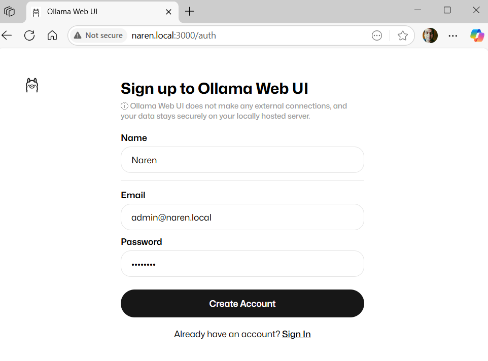

# LangChain + Ollama Interactive Chatbot

This project provides a beginner-friendly, interactive chatbot using [LangChain](https://python.langchain.com/) and your own [Ollama](https://ollama.com/) server. You can run LLMs locally or remotely, chat with them, and get a summary of your conversation.

---

## Features

- Chat with a local or remote Ollama LLM (e.g., `llama3:latest`) using `ChatOllama`.
- Set the model, system prompt, temperature, and Ollama server via environment variables:
  - `OLLAMA_MODEL` (default: llama3:latest)
  - `OLLAMA_SYSTEM_MESSAGE` (default: "I am a Prompt Engineer")
  - `OLLAMA_HOST` (default: http://localhost:11434)
  - `OLLAMA_TEMPERATURE` (default: 0.5)
- Temperature controls the creativity of the model.
- Maintains conversation context and prints a summary table when you type `exit`.

## Project Structure

```
01-langchain-to-ollama/
├── app.py              # Main script (interactive chat)
├── install.sh          # Script to help you install Ollama locally
├── res/
│   ├── ollama.png
│   ├── ollama-web-ui.png
│   ├── user-ollama-web-ui.png
│   └── OI.png
└── README.md           # This file
```

## Setup & Usage

1. **Start your Ollama server** (locally or remotely).
   - See `install.sh` for Docker-based setup and model download.
2. **Install dependencies**
   ```bash
   pip install langchain_ollama
   ```
3. **(Optional) Set environment variables**
   ```bash
   export OLLAMA_HOST=http://your-ollama-server:11434
   export OLLAMA_MODEL=llama3:latest
   export OLLAMA_SYSTEM_MESSAGE="I am a Prompt Engineer"
   export OLLAMA_TEMPERATURE=0.5
   ```
4. **Run the script**
   ```bash
   python app.py
   ```
5. Type your messages at the prompt. Type `exit` to end the chat and see a summary.

## Customization Tips

- Change the system message for different AI personas.
- Adjust temperature for more creative or more focused responses.
- Switch models or servers easily with environment variables.

## Flow Diagram


## Screenshots





## Why use this?

- No API keys or cloud required—run everything on your own machine or server.
- Great for learning, prototyping, and privacy-focused AI workflows.
- Interactive and beginner-friendly: experiment with prompts, models, temperature, and system messages in real time.

---

# install docker

apt install docker.io
pip install jq

# Running with large language models locally.CPU Only

docker run -d -v ollama:/root/.ollama -p 11434:11434 --name ollama ollama/ollama

# Download the model

docker exec -it ollama ollama run llama3

# Check the models

curl -s http://localhost:11434/api/tags | jq

# Install Web UI for Ollama based Models

docker run -d -p 3000:8080 --add-host=host.docker.internal:host-gateway \
 -v ollama-webui:/app/backend/data \
 --name ollama-webui --restart always \
 ghcr.io/ollama-webui/ollama-webui:main

````

python app.py

```py
if __name__ == "__main__":
    messages = []
    if HOST is not None:
        chat = ChatOllama(model=MODEL, temperature=TEMPERATURE, base_url=HOST)
    messages.append(SystemMessage(content=SYSTEM_MESSAGE))
    print("Welcome to panda chatbot.")
    print("About Me:")
    print(f"\tModel: {MODEL},Temperature: {chat.temperature}")
    print(f"\t{SYSTEM_MESSAGE}")

    while True:
        try:
            human_message = input("🗣️ :")
            messages.append(HumanMessage(content=human_message))
            if human_message.strip().lower() == "exit":
                print_on_exit(messages)
                print(f"{EXIT_MESSAGE}")
                break
        except KeyboardInterrupt:
            print(f"{EXIT_MESSAGE}")
            break
        response = chat.invoke(messages)
        print(f"🐼 : {response.content}", end="\n")
        print("\n")
        messages.append(AIMessage(content=response.content))
````
