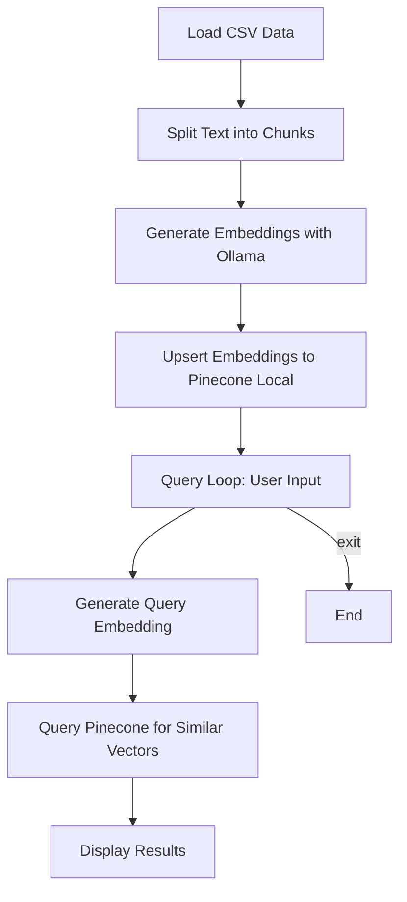

# LangChain to VectorDB (Ollama + Pinecone Local)

This project demonstrates how to use [Ollama](https://ollama.com/) for generating text embeddings and [Pinecone Local](https://docs.pinecone.io/docs/local) as a vector database for storing and querying those embeddings. The workflow is designed for easy experimentation with local LLMs and vector search.

## Features

- Loads data from a CSV file (`res/my-data.csv`).
- Splits text into manageable chunks.
- Generates embeddings for each chunk using Ollama.
- Upserts embeddings into a local Pinecone vector database.
- Provides a command-line interface to query the vector database for similar text.

## Project Structure

```
02-langchain-to-vdb/
├── app.py              # Main script
├── install.sh          # Shell script to run Ollama and pull models
├── .env                # Environment variables for Pinecone hosts
├── res/
│   ├── my-data.csv     # Sample data
│   └── ai-langchain-vectordb.jpg
└── README.md           # This file
```

## Setup & Usage

1. **Start Ollama and Pinecone Local**
   - Use `install.sh` to start Ollama in a container and pull required models.
   - Make sure Pinecone Local is running (see Pinecone docs for setup).
2. **Install Python dependencies**
   ```bash
   pip install langchain_text_splitters pinecone ollama
   ```
3. **Configure Environment (optional)**
   - Edit `.env` to set Pinecone hosts if needed.
   - You can also set OLLAMA_MODEL, OLLAMA_HOST, and OLLAMA_TEMPERATURE as environment variables.
4. **Run the script**
   ```bash
   python app.py
   ```
   - The script will load data, generate embeddings, upsert to Pinecone, and enter a query loop.
   - Type your query and get the most similar text chunks from the database.
   - Type `exit` to quit.

## Data Example

The file `res/my-data.csv` contains sample records:

```
Id,Name, Profession, Age, Country, Gender,Hobby
1,Alice, Engineer, 30, USA, Female, Painting and Cooking
...
```

## Flow Diagram



## Notes

- Ollama and Pinecone Local must be running for the script to work.
- You can customize the chunk size, model, and other parameters in `app.py`.
- This project is for local/demo use and not intended for production.

---

**Author:** naren4b
