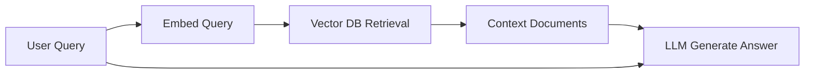
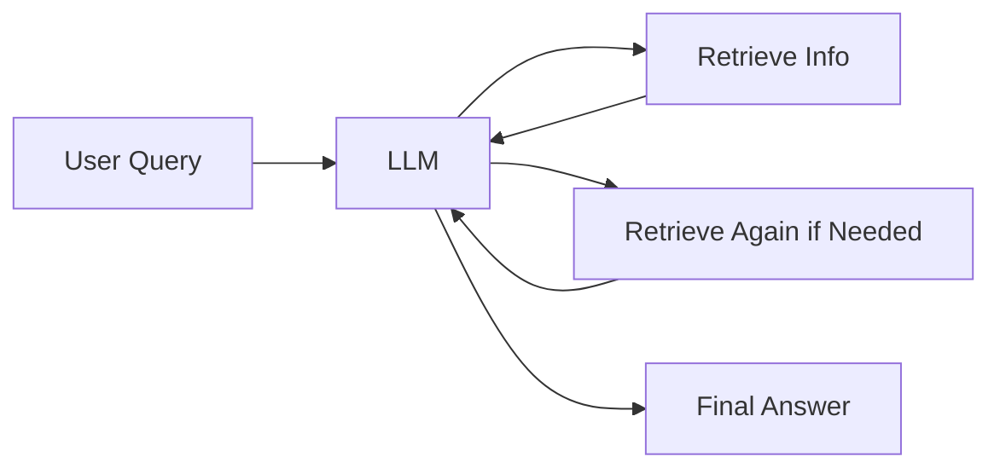
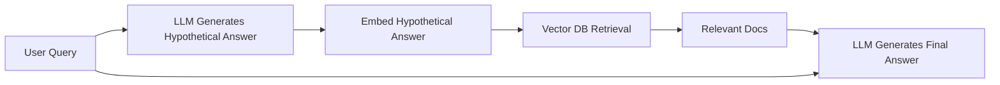
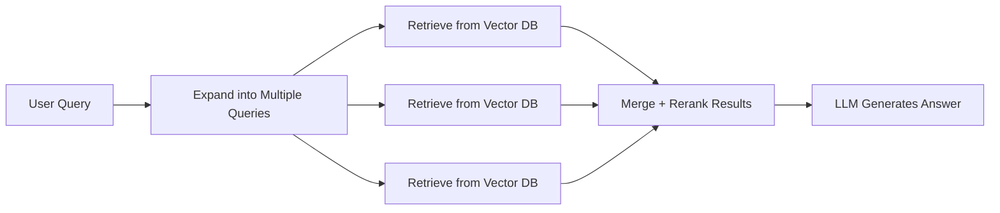
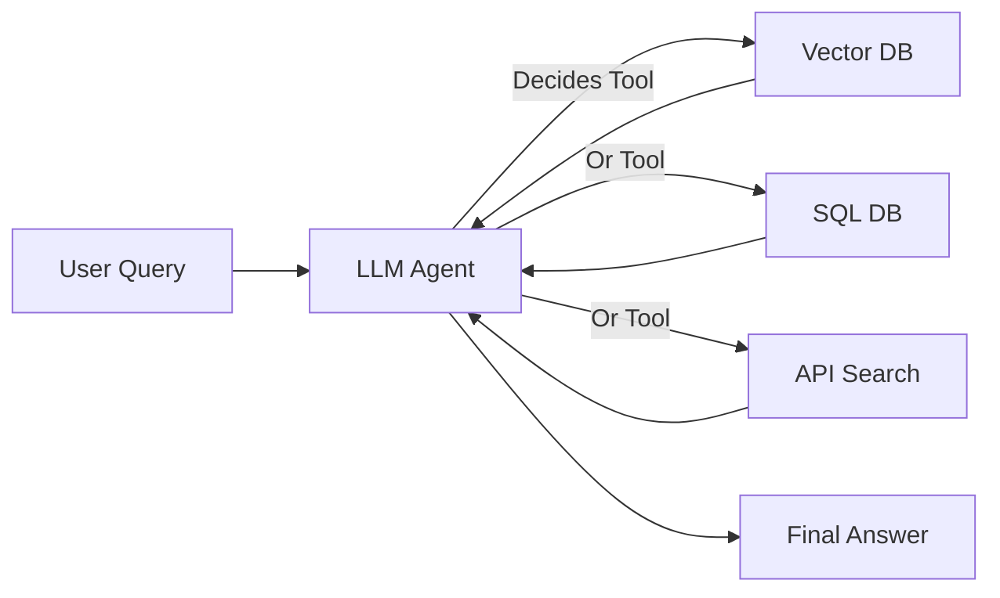
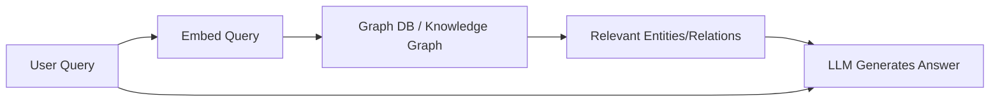
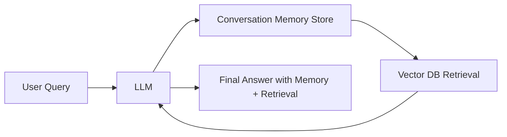
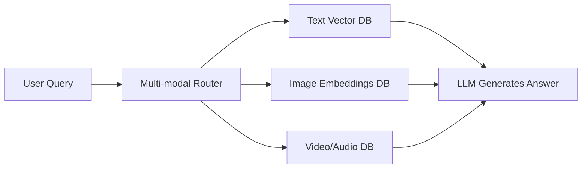

Perfect 👍 Let’s map these **RAG architectures into diagrams** so you can visualize how retrieval integrates with generation. I’ll use **Mermaid diagrams** (which you can render directly in editors like [mermaid.live](https://mermaid.live/)).

---

## 1. **Vanilla RAG**



---

## 2. **Iterative RAG**



---

## 3. **HyDE RAG**



---

## 4. **Fusion-based RAG (Multi-query + Rerank)**



---

## 5. **Agentic RAG**



---

## 6. **Graph-based RAG**



---

## 7. **Streaming / Real-time RAG**

```mermaid
flowchart LR
    Q[User Query] --> R[Real-time Index (Logs, Kafka, Elastic)]
    R --> Docs[Fresh Context Data]
    Docs --> LLM[LLM Generates Answer]
    Q --> LLM
```

---

## 8. **Memory-Augmented RAG**



---

## 9. **Structured RAG (SQL + Docs Hybrid)**

```mermaid
flowchart LR
    Q[User Query] --> Router[LLM Router]
    Router --> SQL[Structured DB (SQL)]
    Router --> VDB[Vector DB]
    SQL --> R1[Structured Results]
    VDB --> R2[Unstructured Docs]
    R1 & R2 --> LLM[LLM Combines + Generates Answer]
```

---

## 10. **Multi-modal RAG**



---

👉 I can also prepare a **single comparison diagram** that shows all these types side by side (at a higher level).

Would you like me to **merge them into one “RAG landscape diagram”** for presentation/teaching purposes, or keep them separate for documentation?
