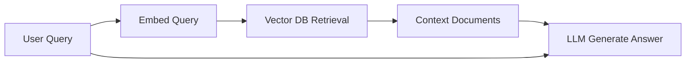
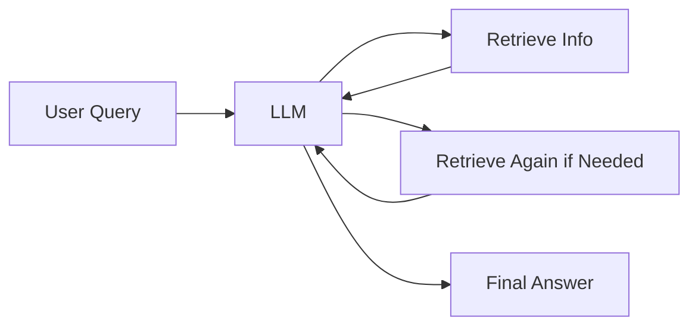
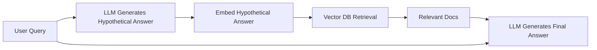
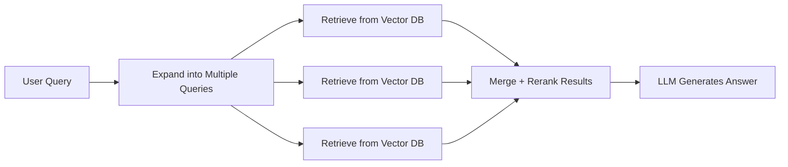
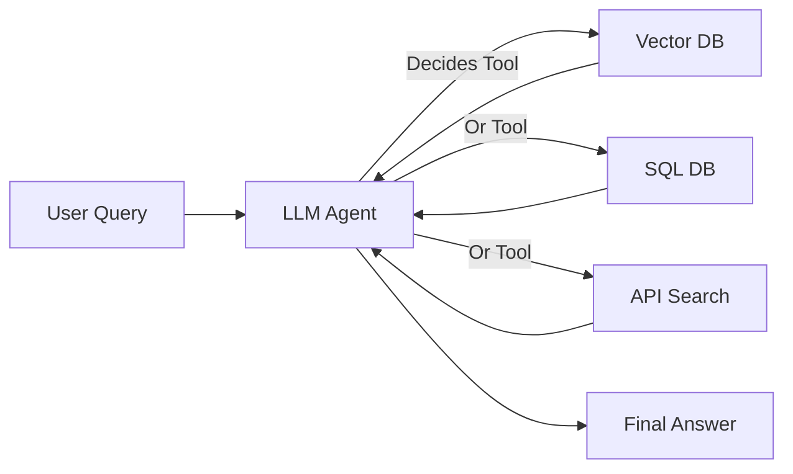
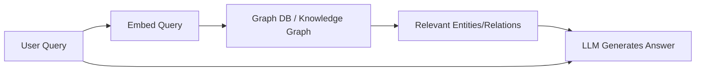
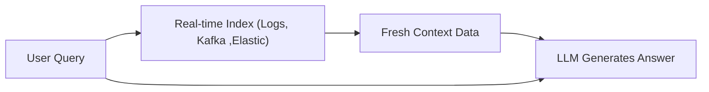
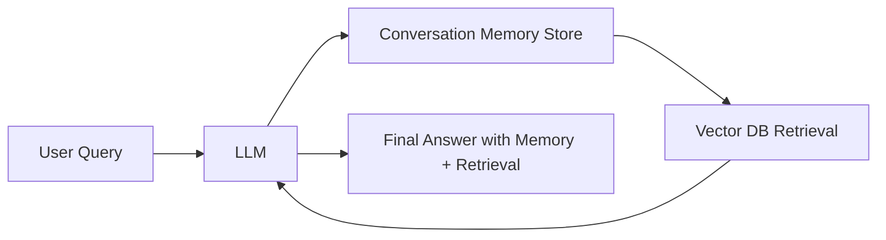
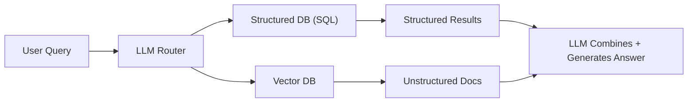
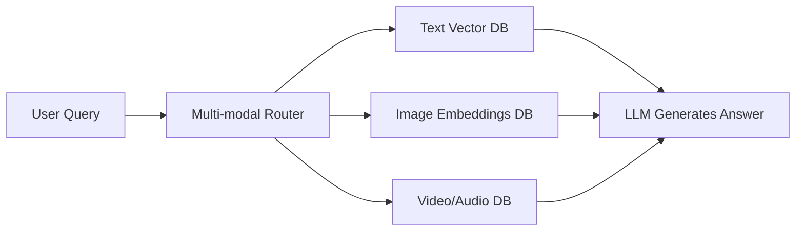

# RAG (Retrieval-Augmented Generation) architectures.

At a high level, RAG systems combine retrieval (fetching relevant information from an external knowledge source) with generation (LLM producing an answer).Different RAG architectures exist depending on where, when, and how retrieval is integrated with the LLM.

---

## 1. **Vanilla (Classic) RAG**

Query → Embed → Vector DB Retrieval → Pass results as context → LLM generates answer.

- Strengths: Simple, widely adopted, easy to implement.
- Limitations: Context window size limits how much information can be retrieved. No dynamic re-check during generation.

- Example: Most open-source RAG pipelines (LangChain, LlamaIndex basic).
- Use case:FAQ, docs Q&A

---

## 2. **Iterative / Multi-turn RAG**

LLM retrieves → generates partial output → realizes it needs more info → retrieves again → continues.

- Strengths: Closer to human-like research, useful for complex multi-step reasoning (e.g., answering medical or legal queries).
- Limitations: Latency (multiple retrieval calls).

- Example: Self-Ask with Search, Chain-of-Thought + Retrieval.
- Use case:Multi-hop Qs

---

## 3. **HyDE (Hypothetical Document Embeddings) RAG**

Query → LLM generates a "hypothetical answer" → Embed that → Retrieve similar docs → LLM answers with evidence.

- Strengths: Improves recall when queries are vague.
- Limitations: Extra step = more compute cost.

- Example: Microsoft’s HyDE paper.
- Use case:Ambiguous queries

---

## 4. **Fusion-based RAG (Query Expansion + Ranking)**

Multi-query RAG → Expand one query into multiple semantically different queries → retrieve → fuse results. Reranker-enhanced RAG → Use cross-encoder/LLM to rank retrieved passages.

- Strengths: Higher accuracy, better coverage of knowledge.
- Limitations: More complexity, more latency.

- Example: ColBERT + reranking pipelines.
- Use case:Research, compliance

---

## 5. **Agentic RAG (Tool-using RAG)**

LLM acts as an agent → decides when/how to query external tools (DBs, APIs, search engines) → merges results into final output.

- Strengths: More flexible than vanilla RAG. Can combine structured + unstructured data.
- Limitations: Requires orchestration, prompt engineering, and guardrails.

- Example: LangChain Agents, OpenAI’s “GPTs” with tools.
- Use case:Assistants, workflows

---

## 6. **Graph-based RAG**

Knowledge graph retrieval instead of (or along with) vector DB.

- Strengths: Excellent for highly relational data (fraud detection, biomedical, supply chain).
- Limitations: Building/maintaining KG is heavy.

- Example: Neo4j + LLM, RDF triple queries.
- Use case:Biomedical, fraud

---

## 7. **Streaming / Real-time RAG**

Query → Retrieve from real-time indexes (e.g., logs, Kafka, Elasticsearch) → LLM answers.

- Strengths: Useful for time-sensitive data (finance, observability, monitoring).
- Limitations: Hard to manage scaling + freshness.

- Example: Stock market chatbot, monitoring assistant.
- Use case:Finance, logs

---

## 8. **Memory-Augmented RAG**

RAG + Long-term memory (persistent store of previous conversations, summaries, embeddings).

- Strengths: Personalized assistants, ongoing learning.
- Limitations: Memory drift, need for pruning/summarization.

- Example: ChatGPT “memory” feature, LangChain ConversationBuffer + RAG.
- Use case:Chatbots, coaching

---

## 9. **Structured RAG (SQL + Docs Hybrid)**

LLM routes query → structured DB (SQL/Graph) OR vector DB OR both → merges results.

- Strengths: Handles structured + unstructured data together.
- Limitations: Requires schema alignment + query planning.

- Example: Retrieval-Oriented Toolformer.
- Use case:Enterprise data

---

## 10. **Advanced Architectures(Multi-modal RAG)**

ReAct RAG (Reason + Act): LLM alternates between reasoning and retrieval.
RAG with Fine-tuning: LLM fine-tuned on domain-specific retrieval outputs.

- Strengths: Multi-modal RAG: Retrieval not just from text, but images, audio, video.
- Limitations: complex

- Example:
- Use case:Media, AI copilots

---

👉 I can also prepare a **single comparison diagram** that shows all these types side by side (at a higher level).

Would you like me to **merge them into one “RAG landscape diagram”** for presentation/teaching purposes, or keep them separate for documentation?
