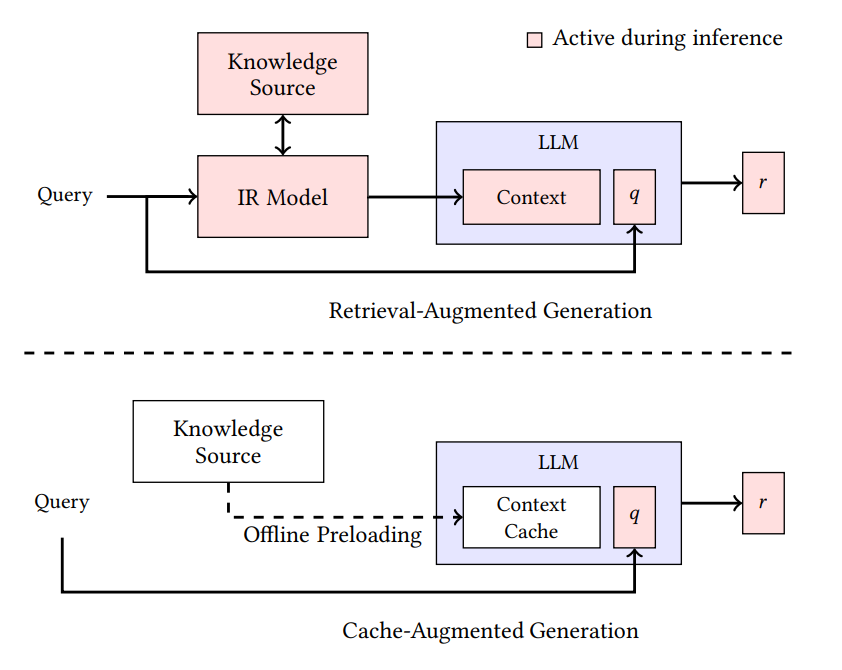

# What is RAG (Retrieval Augmented Generation) & CAG(Cache-Augmented Generation)?

[ai-rag-cag](ai-rag-cag.jpg)

## What is a RAG ?

- Retrieval-Augmented Generation (RAG) is the process of optimizing the output of a large language model, so it references an authoritative knowledge base outside of its training data sources before generating a response.
- LLMs are trained on vast datasets, but these will not include your specific data. Retrieval-Augmented Generation (RAG) addresses this by dynamically incorporating your data during the generation process.
- This is done not by altering the training data of LLMs, but by allowing the model to access and utilize your data in real-time to provide more tailored and contextually relevant responses.

**What are the benefits of RAG**:

1. Access to real-time data and proprietary or domain-specific data: bring in knowledge relevant to your situation - current events, news, social media, customer data, proprietary data
2. Builds trust: more relevant and accurate results are more likely to earn trust and source citations allow human review
3. More control: control over which sources are used, real-time data access, authorization to data, guardrails/safety/compliance, traceability/source citations, retrieval strategies, cost, tune each component independently of the others
4. Cost-effective compared to alternatives like training/re-training your own model, fine-tuning, or stuffing the context window: foundation models are costly to produce and require specialized knowledge to create, as is fine-tuning; the larger the context sent to the model, the higher the cost
5. Lower risk of AI hallucinations
6. Expanded use cases: Access to more data means that one model can handle a wider range of prompts.

**How does Retrieval-Augmented Generation work?**

1. **Create external data**, the data that is LLM is not trained on , i.e. current news, updates , on company/person specific data using embedding language models.That is called as **Knowledge Source**:- Vector Store.
2. **Retrieve relevant information** from a KV Data base efficiently (**initial retrieval** and **reranking**)
3. **Augment the LLM prompt** to give enhanced context(Context Window) along with the query.
4. **Update external data regularly** to keep up the freshness of the data .

**Two-stage retrieval system**:
Retrieval-Augmented Generation (RAG) Pipeline is a two-stage retrieval system. It involves two critical steps: **initial retrieval** and **reranking**.

**Initial Retrieval** : This first stage uses a vector database powered by bi-encoders or sparse embedding models to quickly retrieve a set of potentially relevant documents. The primary focus here is on retrieval recall — casting a wide net to ensure that as much relevant information as possible is captured.

**Reranking**: After the initial retrieval, the second stage employs a reranker, often a cross-encoder, to reorder the documents based on their relevance to the user’s query. This step is crucial for maximizing LLM recall, ensuring that the most contextually relevant documents are prioritized and passed to the LLM.

**Knowledge Source**:- Vector Store

- A vector store is a specialized system designed to store and manage vectors which are mathematical representations of data points in a multi-dimensional space. These vectors often referred to as vector embeddings are crucial in various applications particularly in machine learning as they allow for efficient similarity searches and data retrieval.
- Example :

```
# about gender
   man - woman
   king - queen

# about verb and their tense

   walk - walking
   talk - taking

# Effectively captures the relationships between countries and their capitals Country and their Capital

   India - New Delhi
   Canada - Ottawa
   Japan - Tokyo

```

In our case we will **PineCone** :


Pinecone is the leading vector database for building accurate and performant AI applications at scale in production.

**Embedding Model**:

An embedding model is a type of machine learning model that converts data (like text, images, or audio) into a numerical representation called an embedding

1. Data Input: Embedding models take in raw data, such as text, images, or audio, as input.
2. Feature Extraction: The model analyzes the input data and identifies key features or characteristics.
3. Vector Representation: The model then converts these features into a vector of numbers (the embedding).
4. Proximity Matters: Vectors representing similar data points will be placed close to each other in the vector space, while dissimilar data points will be further apart.

Host PineCone
docker-compose.yaml

```docker
services:
  pinecone:
    image: ghcr.io/pinecone-io/pinecone-local:latest
    environment:
      PORT: 5080
      PINECONE_HOST: localhost
    ports:
      - "5080-5090:5080-5090"
    platform: linux/amd64
```

To start Pinecone Local, run the following command:

```
docker compose up -d
```

In Pinecone, there are two types of indexes for storing vector data: **Dense indexes** & **sparse indexes**.

1. **Dense indexes** store dense vectors, which are a series of numbers that represent the meaning and relationships of text, images, or other types of data. Each number in a dense vector corresponds to a point in a multidimensional space. Vectors that are closer together in that space are semantically similar.

_When you query a dense index, Pinecone retrieves the dense vectors that are the most semantically similar to the query. This is often called **semantic search**, nearest neighbor search, similarity search, or just vector search._

2. **Sparse indexes** store sparse vectors, which are a series of numbers that represent the words or phrases in a document. Sparse vectors have a very large number of dimensions, where only a small proportion of values are non-zero. The dimensions represent words from a dictionary, and the values represent the importance of these words in the document.

_When you search a sparse index, Pinecone retrieves the sparse vectors that most exactly match the words or phrases in the query. Query terms are scored independently and then summed, with the most similar records scored highest. This is often called **lexical search** or **keyword search**._

```py
from pinecone.grpc import PineconeGRPC, GRPCClientConfig
from pinecone import ServerlessSpec


pc = PineconeGRPC(
    api_key="pclocal",
    host="http://localhost:5080"
)

dense_index_name = "dense-index"
sparse_index_name = "sparse-index"

if not pc.has_index(dense_index_name):
    dense_index_model = pc.create_index(
        name=dense_index_name,
        vector_type="dense",
        dimension=2,
        metric="cosine",
        spec=ServerlessSpec(cloud="aws", region="us-east-1"),
        deletion_protection="disabled",
        tags={"environment": "development"}
    )

print("Dense index model:\n", dense_index_model)

if not pc.has_index(sparse_index_name):
    sparse_index_model = pc.create_index(
        name=sparse_index_name,
        vector_type="sparse",
        metric="dotproduct",
        spec=ServerlessSpec(cloud="aws", region="us-east-1"),
        deletion_protection="disabled",
        tags={"environment": "development"}
    )

print("\nSparse index model:\n", sparse_index_model)

```

**Upsert(Ingestion) the Data**:

Prepare a sample dataset of factual statements from different domains like history, physics, technology, and music. Model the data as as records with an ID, text, and category.

```py
records = [
    { "_id": "rec1", "chunk_text": "The Eiffel Tower was completed in 1889 and stands in Paris, France.", "category": "history" },
    { "_id": "rec2", "chunk_text": "Photosynthesis allows plants to convert sunlight into energy.", "category": "science" },
    { "_id": "rec3", "chunk_text": "Albert Einstein developed the theory of relativity.", "category": "science" },
    { "_id": "rec4", "chunk_text": "The mitochondrion is often called the powerhouse of the cell.", "category": "biology" },
    { "_id": "rec5", "chunk_text": "Shakespeare wrote many famous plays, including Hamlet and Macbeth.", "category": "literature" },
    { "_id": "rec6", "chunk_text": "Water boils at 100°C under standard atmospheric pressure.", "category": "physics" },
    { "_id": "rec7", "chunk_text": "The Great Wall of China was built to protect against invasions.", "category": "history" },
    { "_id": "rec8", "chunk_text": "Honey never spoils due to its low moisture content and acidity.", "category": "food science" },
    { "_id": "rec9", "chunk_text": "The speed of light in a vacuum is approximately 299,792 km/s.", "category": "physics" },
    { "_id": "rec10", "chunk_text": "Newton's laws describe the motion of objects.", "category": "physics" },
    { "_id": "rec11", "chunk_text": "The human brain has approximately 86 billion neurons.", "category": "biology" },
    { "_id": "rec12", "chunk_text": "The Amazon Rainforest is one of the most biodiverse places on Earth.", "category": "geography" },
    { "_id": "rec13", "chunk_text": "Black holes have gravitational fields so strong that not even light can escape.", "category": "astronomy" },
    { "_id": "rec14", "chunk_text": "The periodic table organizes elements based on their atomic number.", "category": "chemistry" },
    { "_id": "rec15", "chunk_text": "Leonardo da Vinci painted the Mona Lisa.", "category": "art" },
    { "_id": "rec16", "chunk_text": "The internet revolutionized communication and information sharing.", "category": "technology" },
    { "_id": "rec17", "chunk_text": "The Pyramids of Giza are among the Seven Wonders of the Ancient World.", "category": "history" },
    { "_id": "rec18", "chunk_text": "Dogs have an incredible sense of smell, much stronger than humans.", "category": "biology" },
    { "_id": "rec19", "chunk_text": "The Pacific Ocean is the largest and deepest ocean on Earth.", "category": "geography" },
    { "_id": "rec20", "chunk_text": "Chess is a strategic game that originated in India.", "category": "games" },
    { "_id": "rec21", "chunk_text": "The Statue of Liberty was a gift from France to the United States.", "category": "history" },
    { "_id": "rec22", "chunk_text": "Coffee contains caffeine, a natural stimulant.", "category": "food science" },
    { "_id": "rec23", "chunk_text": "Thomas Edison invented the practical electric light bulb.", "category": "inventions" },
    { "_id": "rec24", "chunk_text": "The moon influences ocean tides due to gravitational pull.", "category": "astronomy" },
    { "_id": "rec25", "chunk_text": "DNA carries genetic information for all living organisms.", "category": "biology" },
    { "_id": "rec26", "chunk_text": "Rome was once the center of a vast empire.", "category": "history" },
    { "_id": "rec27", "chunk_text": "The Wright brothers pioneered human flight in 1903.", "category": "inventions" },
    { "_id": "rec28", "chunk_text": "Bananas are a good source of potassium.", "category": "nutrition" },
    { "_id": "rec29", "chunk_text": "The stock market fluctuates based on supply and demand.", "category": "economics" },
    { "_id": "rec30", "chunk_text": "A compass needle points toward the magnetic north pole.", "category": "navigation" },
    { "_id": "rec31", "chunk_text": "The universe is expanding, according to the Big Bang theory.", "category": "astronomy" },
    { "_id": "rec32", "chunk_text": "Elephants have excellent memory and strong social bonds.", "category": "biology" },
    { "_id": "rec33", "chunk_text": "The violin is a string instrument commonly used in orchestras.", "category": "music" },
    { "_id": "rec34", "chunk_text": "The heart pumps blood throughout the human body.", "category": "biology" },
    { "_id": "rec35", "chunk_text": "Ice cream melts when exposed to heat.", "category": "food science" },
    { "_id": "rec36", "chunk_text": "Solar panels convert sunlight into electricity.", "category": "technology" },
    { "_id": "rec37", "chunk_text": "The French Revolution began in 1789.", "category": "history" },
    { "_id": "rec38", "chunk_text": "The Taj Mahal is a mausoleum built by Emperor Shah Jahan.", "category": "history" },
    { "_id": "rec39", "chunk_text": "Rainbows are caused by light refracting through water droplets.", "category": "physics" },
    { "_id": "rec40", "chunk_text": "Mount Everest is the tallest mountain in the world.", "category": "geography" },
    { "_id": "rec41", "chunk_text": "Octopuses are highly intelligent marine creatures.", "category": "biology" },
    { "_id": "rec42", "chunk_text": "The speed of sound is around 343 meters per second in air.", "category": "physics" },
    { "_id": "rec43", "chunk_text": "Gravity keeps planets in orbit around the sun.", "category": "astronomy" },
    { "_id": "rec44", "chunk_text": "The Mediterranean diet is considered one of the healthiest in the world.", "category": "nutrition" },
    { "_id": "rec45", "chunk_text": "A haiku is a traditional Japanese poem with a 5-7-5 syllable structure.", "category": "literature" },
    { "_id": "rec46", "chunk_text": "The human body is made up of about 60% water.", "category": "biology" },
    { "_id": "rec47", "chunk_text": "The Industrial Revolution transformed manufacturing and transportation.", "category": "history" },
    { "_id": "rec48", "chunk_text": "Vincent van Gogh painted Starry Night.", "category": "art" },
    { "_id": "rec49", "chunk_text": "Airplanes fly due to the principles of lift and aerodynamics.", "category": "physics" },
    { "_id": "rec50", "chunk_text": "Renewable energy sources include wind, solar, and hydroelectric power.", "category": "energy" }
]


# Target the index
dense_index = pc.Index(index_name)

# Upsert the records into a namespace
dense_index.upsert_records("example-namespace", records)

# Wait for the upserted vectors to be indexed
import time
time.sleep(10)

# View stats for the index
stats = dense_index.describe_index_stats()
print(stats)


```

**Search the Vector**

```
# Define the query
query = "Famous historical structures and monuments"

# Search the dense index
results = dense_index.search(
    namespace="example-namespace",
    query={
        "top_k": 10,
        "inputs": {
            'text': query
        }
    }
)

# Print the results
for hit in results['result']['hits']:
        print(f"id: {hit['_id']:<5} | score: {round(hit['_score'], 2):<5} | category: {hit['fields']['category']:<10} | text: {hit['fields']['chunk_text']:<50}")

```

**Rerank results**
To get a more accurate ranking, search again but this time rerank the initial results based on their relevance to the query.

_To rerank initial results as an integrated part of a query, without any extra steps, use the search operation with the rerank parameter, including the hosted reranking model you want to use, the number of reranked results to return, and the fields to use for reranking, if different than the main query.
For example, the following code searches for the 3 records most semantically related to a query text and uses the hosted bge-reranker-v2-m3 model to rerank the results and return only the 2 most relevant documents:_

```
from pinecone import Pinecone

pc = PineconeGRPC(
    api_key="pclocal",
    host="http://localhost:5080"
)

# To get the unique host for an index,
# see https://docs.pinecone.io/guides/manage-data/target-an-index
dense_index_name = "dense-index"
index = pc.Index(host="INDEX_HOST")

ranked_results = index.search(
    namespace="dense_index_name",
    query={
        "inputs": {"text": "Disease prevention"},
        "top_k": 4
    },
    rerank={
        "model": "bge-reranker-v2-m3",
        "top_n": 2,
        "rank_fields": ["chunk_text"]
    },
    fields=["category", "chunk_text"]
)

print(ranked_results)
```

## What is a CAG ?

Cache-Augmented Generation (CAG) is emerging as a compelling alternative to Retrieval-Augmented Generation (RAG) for improving the performance of large language models (LLMs). Unlike RAG, which dynamically retrieves external knowledge during inference, CAG preloads essential information into the model’s memory, leveraging the caching of key-value (KV) pairs within the Transformer attention mechanism.


[Comparison of Retrieval-Augmented Generation (RAG) and our Cache-Augmented Generation (CAG) Workflows: The pink-shaded components represent the processes active during real-time inference.](https://arxiv.org/pdf/2412.15605)

- In RAG (top section), the IR model retrieves relevant information from the knowledge source, and both the retrieved knowledge and query
  are processed by the LLM during inference, introducing retrieval latency.
- In contrast, CAG (bottom section) preloads and caches knowledge offline, allowing the LLM to process only the query during inference, eliminating retrieval overhead and ensuring a more efficient generation process

- **Efficient Alternative to RAG**: We introduced a novel approach leveraging long-context LLMs with preloaded documents and precomputed KV caches, mitigating retrieval latency, errors, and system complexity.
- **Quantitative Analysis**: We conducted extensive experiments showing scenarios where long-context LLMs outperform traditional RAG systems, especially with manageable knowledge bases.
- **Practical Insights**: This work provided actionable insights into optimizing knowledge-intensive workflows, demonstrating the viability of retrieval-free methods for specific applications. Our CAG framework is released publicly.1


# Scenario: Will build a clinical decision support system for hospitals.
Idea is that doctors need to query patient records and treatment guides and drug interactions and the responses need to be really comprehensive and of course, very accurate because they're going to be used by doctors during patient consultations.

- Because in this case, the system could first use RAG to retrieve the most relevant subset from the massive knowledge base.
So pulling in specific sections of a particular patient's history and some research papers that are based on the doctor's query.
- And then instead of simply passing those retrieved chunks to the LLM, it could load all that retrieved content into a long context model that uses CAG, creating a temporary working memory, if you like, for the specific patient case.

So it's really a hybrid approach.

RAG's ability to efficiently search enormous knowledge bases, and then CAG's capability for providing the full breadth of medical knowledge when needed for those follow-up questions without the system repeatedly querying the database.
1. Initial Query: Doctor asks a medical question.
2. RAG Retrieval: Searches patient records, research papers, and drug data → retrieves relevant chunks.
3. CAG Preload: The retrieved content is preloaded into the LLM’s KV cache (internal memory in the Transformer’s attention mechanism).
4. LLM Response: The model uses both the query and the cached context to generate an answer.
5. Follow-up Q&A: Follow-up questions are answered instantly using the cached context, without repeating retrieval.

